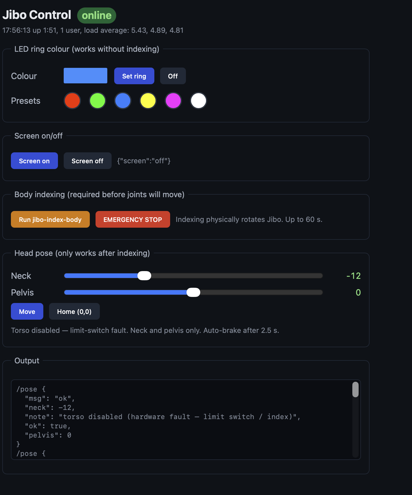

# Jibo unlock notes

A working reference for what it took to bring a stock-firmware Jibo back into a usable, hackable state after the cloud shutdown — written from a hands-on session, distilled into something useful for the next person who picks up an abandoned Jibo and wants to do something with it.

Nothing here is original work. The hard reverse-engineering and tooling was all done by the [Jibo Revival Group](https://jibo-revival-group.github.io/), the [`jibodev`](https://github.com/jibodev) GitHub org, and Torben Wetter. This is a clean writeup of the path that worked for me, with attribution.

## What is Jibo

Jibo was a social/companion robot designed by Cynthia Breazeal at MIT, built by Jibo Inc., and shipped to consumers in 2017 for around $899. It has a small expressive head on a 3-axis articulated body, with a 720×1280 portrait display where its single "eye" (an animated white circle) lives. There's a microphone array, speakers, a 1080p camera, an LED ring around its body, and capacitive touch sensors. Internally it runs a Buildroot Linux on an NVIDIA Tegra K1 (T124) SoC.

Jibo Inc. went out of business in late 2018. Its IP changed hands a few times, the cloud servers it depended on were shut down (with one final OTA "goodbye" message in 2019), and most units have been bricked-but-physically-fine ever since. Coverage of the shutdown is in the references below.

For the broader product overview see the [robotsguide.com Jibo entry](https://robotsguide.com/robots/jibo) and the [MIT Media Lab project page](https://www.media.mit.edu/projects/jibo-research-platform/).

## The cloud-brick situation

Stock Jibo firmware does an HTTPS handshake with `api.jibo.com` (and a couple of sibling hosts: `api-socket.jibo.com`, `neo-hub.jibo.com`, plus a region-specific `*-entrypoint.jibo.com`) very early in boot. When that handshake fails, the device sits indefinitely on a boot splash showing the word "jibo." It does not time out, it does not boot to a usable desktop, and there is no "offline mode."

This is what most owners see when they plug in a Jibo today. Power on → wait → "jibo" splash forever. With the original cloud servers offline and Jibo Inc.'s signing keys unrecoverable, no amount of waiting, network tricks, or app reinstalls fix this. The device is otherwise hardware-healthy.

The community workaround treats Jibo as just-another-Tegra-K1 device and uses a known boot ROM exploit to put it into a "developer mode" so you can SSH in and decide what to do next.

## Hardware in brief

| Component | Detail |
|---|---|
| SoC | NVIDIA Tegra K1 (T124), ARMv7-A, four Cortex-A15 cores |
| RAM | 2 GB DDR3L |
| Storage | ~16 GB eMMC, partitioned with `/`, `/var`, `/skills`, etc. |
| Display | 720×1280 portrait LCD with backlight, driven by `tegra_dc` + X11 |
| Audio | speakers + 6-mic array |
| Vision | front-facing 1080p camera |
| Motion | 3 actuated axes (pelvis rotation, torso tilt, neck) plus capacitive touch |
| LED | a programmable RGB ring around the body |
| Wireless | TI WL18xx WiFi (5 GHz capable) + Bluetooth |
| Recovery | rear micro-USB exposes the Tegra recovery (RCM) port |

The motherboard layout, debug header pinouts, and power rails are documented in the [`jibodev/HW_Notes`](https://github.com/jibodev/HW_Notes) repo.

## Why this works at all: Fusée Gelée on T124

The Tegra K1 boot ROM (which is identical across all T124 devices, including the original Jetson TK1, the Nvidia Shield Tablet, and Jibo) has a USB recovery mode whose RCM CMD parsing has a buffer-overflow vulnerability — a stack smash through a poisoned `GET_STATUS` control transfer. Once you have the chip in RCM and you can talk to it over USB as `0955:7740 NVIDIA Corp. APX`, you can drop arbitrary code into IRAM and run it.

The same family of exploits enabled the Nintendo Switch homebrew scene. The T124 port and the analysis writeup are at:

- [fail0verflow's ShofEL2 blog post](https://fail0verflow.com/blog/2018/shofel2/) — original Tegra X1 exploit
- Katherine Temkin's [`fusee-launcher` and Fusée Gelée writeup](https://github.com/Qyriad/fusee-launcher/blob/master/report/fusee_gelee.md) — same family, used as reference for the T124 port
- [`wertus33333/ShofEL2-for-T124`](https://github.com/wertus33333/ShofEL2-for-T124) — base T124 port (Shield Tablet target)
- [`jibodev/ShofEL2-for-T124-Jibo`](https://github.com/jibodev/ShofEL2-for-T124-Jibo) — the Jibo-flavoured fork (sets the right USB PID and a few addresses)

These give you a working "load and run arbitrary ARM payload in IRAM" primitive on a Jibo. They don't, by themselves, modify Jibo's flash storage.

## The unlock recipe (high level)

The community-recommended path doesn't replace the OS. Instead it modifies one config file (`/var/jibo/mode.json`) so the stock OS boots into a development mode that:

- Skips the cloud-handshake gate
- Disables the firewall
- Starts an SSH server with a default `root` / `jibo` login

The flow has three phases:

### 1. Build the right exploit fork

The standard `ShofEL2-for-T124-Jibo` fork only has the IRAM/USB primitive. To touch eMMC you need [`devsparx/ShofEL2-for-T124`](https://github.com/devsparx/ShofEL2-for-T124) on the `improvements/IncreasedUSBReadWriteSpeed` branch, which adds an `emmc_server` ARM payload and host commands `EMMC_READ`, `EMMC_WRITE`, `EMMC_ERASE`, `EMMC_READ_EXT_CSD`. This payload brings up Jibo's SDMMC4 controller from IRAM, which sidesteps the chicken-and-egg "you need DRAM to read eMMC, but DRAM init lives in eMMC" problem.

Build host needs:
- A real Linux box (the host loader uses Linux `usbdevfs` ioctls — macOS and Windows don't work as the host)
- `gcc-arm-none-eabi` (cross-compiler for the ARM payloads)
- `libusb-1.0-0-dev` (host loader)
- A udev rule allowing your user to read/write USB VID `0955` (Tegra recovery) without sudo

### 2. Mod the `/var` partition

1. Trigger RCM on the Jibo. Per Torben Wetter's writeup: hold the *lower* of the two small buttons on the back, then tap the larger middle button once. The front LED turns red and the device enumerates over USB as `NVIDIA Corp. APX`.
2. `EMMC_READ` the `/var` partition (offset is published in the Revival Group's [JiboAutoMod guide](https://github.com/jibodev/JiboAutoMod) — partition 5, around 500 MB, ext4 with journal). Takes ~9 minutes.
3. Run `e2fsck -y -f` against the dump. The partition is "needs journal recovery" because you read it hot.
4. Edit `/jibo/mode.json` from `{"mode":"normal"}` to `{"mode":"int-developer"}`. The cleanest way is `debugfs -w` because that doesn't need root or `mount`. **Important:** when using debugfs you must explicitly `set_inode_field` `mode` to `0100644` (full `S_IFREG | 0644`), `uid 0`, `gid 0`. If you set just `0644` debugfs reports the file as `Type: bad type` and the system won't see it.
5. Re-trigger RCM, `EMMC_WRITE` the modified partition back. ~14 minutes. Don't unplug.
6. Power-cycle Jibo (no RCM combo this time, just power). The display now shows a big green check mark instead of the boot splash. SSH in: `ssh root@<ip>` password `jibo`. **Change the default password immediately** — the `int-developer` mode disables the firewall so anything on the network can hit it.

### 3. Persistent SSH key and configuration

The rootfs is mounted read-only by default. To add an SSH public key, change the password, or edit other system files persistently:

```
mount -o remount,rw /
# ...changes...
mount -o remount,ro /
```

Once you have an SSH key in `/root/.ssh/authorized_keys` you can throw away the default password.

The hard work has been packaged into a single tool: [`JiboAutoMod`](https://github.com/jibodev/JiboAutoMod) wraps the whole flow above into a Python script with prompts. If you'd rather follow the steps by hand, the kevinblog Gitea has more granular notes at <https://kevinblog.sytes.net/Code/Jibo-Revival-Group/>.

## What you can do once unlocked

| Capability | How |
|---|---|
| **Root SSH** | Default `root`/`jibo`, change immediately. Pubkey auth works after `mount -o remount,rw /`. |
| **Display on/off** | `POST http://<jibo-ip>:8282/screen` with `{"screen":"on"\|"off"}` to the local body-service. |
| **LED ring colour** | Persistent WebSocket to `ws://<jibo-ip>:8282/led_command`, send JSON `{ts:[0,0], color:[r,g,b], rate_limit:[r,r,r]}` (floats 0..1) every ~100 ms. The body-service decays the ring if you stop sending. |
| **Head pose / body rotation** | `jibo-pose-body neck torso pelvis` (degrees). Requires `jibo-index-body` to have run successfully first — that physically rotates each axis to find its limit switch. The script is designed to "move and hold," so run it in the background and kill after the move completes. Send a BRAKE-mode `axis_command` (mode 2) afterwards or the axis keeps executing the last velocity command. |
| **Arbitrary text on the front display** | Pause `jibo-expression.js` with `SIGSTOP`, run `xterm -fullscreen` over X11 with the text, `SIGCONT` after. Auth file is in `/tmp/.serverauth.<pid>` — find the latest with `ls -t /tmp/.serverauth.* \| head -1`. The font `Mono` at point size 80 is readable to a webcam. **Always send `SIGCONT` before your script exits** or expression freezes and the display goes dark when the body-service idle-timer trips after about 5 minutes. |
| **Local audio playback** | `aplay file.wav` works once you SCP audio files in. The full Jibo TTS service is a separate process that's harder to use directly. |
| **Camera capture** | `/dev/video0` exposed via standard V4L2; ffmpeg can grab frames. |
| **ROS-style WebSocket inspection** | `ws://<jibo-ip>:8282/{axis_state,axis_command,imu,touch,power,misc,led_state,led_command,faults}`. The body-service includes a built-in web UI at `http://<jibo-ip>:8282/` whose JS source documents the full message schemas — read `/usr/local/var/www/bodyservice/bs.js`. |

A small Flask web UI driving most of these from a browser is straightforward to build. About 250 lines including HTML. Example layout:



That's: an LED ring colour picker with presets, screen on/off, body indexing + emergency stop, head pose sliders (with torso disabled in this example because of a per-unit limit-switch fault), and a JSON output panel. Backend talks directly to the body-service over HTTP and WebSocket on `:8282`, and to `jibo-pose-body` / `jibo-index-body` over SSH.

## What you can't do without further effort

Anything that depends on Jibo's original cloud (which is offline):

- **The full eye animation** — `jibo-expression.js` waits for cloud authentication before rendering the proper eye. In `int-developer` mode it falls back to the green check.
- **Wake-word / voice interaction** — the wake-word listener (`jibo-asr-service`) needs cloud-issued tokens to upload audio for recognition.
- **Skills / "Hey Jibo" routines** — the skill manager waits for cloud-bound credentials.
- **The companion app** — pairs through a cloud-issued device certificate.
- **OTA updates** — query the now-dead `Update_*` API.

The Revival Group is rebuilding a substitute cloud at [`Jibo-Revival-Group/JiboExperiments`](https://kevinblog.sytes.net/Code/Jibo-Revival-Group/JiboExperiments) — see their `OpenJibo` directory. Their published Node prototype implements all the AWS-style HTTP services (`Notification_20150505`, `Account_20151111`, `Loop_20160324`, `Robot_20160225`, `Person_20160801`, `Media_20160725`, `Update_20160301`, etc.) and the `neo-hub` WebSocket flow. The remaining gate to plugging your unit into that substitute cloud is the TLS layer: stock Jibo HTTPS clients trust certs signed by Jibo Inc.'s CA, and you need either certs that chain to that CA or device-side TLS-validation patches. The Revival Group has working cert material that they distribute through their Discord; you can ask there.

If you'd rather skip the cloud entirely and just use Jibo as a programmable platform, the SSH-and-WebSocket surface is plenty. There's a thriving "use Jibo as a ROS-style sensor/motor head with your own controller code" angle that needs no cloud at all.

## Operational gotchas worth knowing

- **WiFi DHCP race on first boot in int-developer mode.** The interfaces config runs `udhcpc` *before* `wireless-startup` brings up `wpa_supplicant`. First DHCP attempt fails. Sometimes the unit settles into a self-loop fallback (IP `10.10.1.1/24`, default gateway via itself). Fix: SSH in via IPv6 link-local or ULA (avahi advertises both) and run `udhcpc -i wlan0 -n`.
- **`/tmp` is `noexec`.** Helper scripts work fine but you have to invoke them as `sh /tmp/script.sh`, not `/tmp/script.sh`.
- **Body-service idle timer.** If nothing has touched the screen subsystem for ~5 minutes, the body-service sends `screen requested off` to the panel — you'll see a black screen even though X is up. POST `{"screen":"on"}` to the body-service's `/screen` endpoint to wake it.
- **`jibo-platform-test` is destructive.** It's the manufacturing test suite. It exercises every motor, LED, and TTS line. On a unit that's been sitting idle for years it can stress WiFi enough to kick the unit off the network mid-test. Don't run it for fun.
- **Body indexing (`jibo-index-body`)** runs the full physical rotation routine every time you call it — it doesn't check whether axes are already indexed. Each invocation re-spins the pelvis. If you stall against an obstacle (e.g. a wall) the body board faults and that axis stays in `BRAKE` mode until you power-cycle the body board GPIOs (`/sys/class/gpio/gpio82/value` for torso+pelvis, `gpio140` for head).
- **Don't `ip addr flush dev wlan0`** to "reset" connectivity — it disassociates everything. Use `udhcpc -i wlan0 -n` to re-lease without flushing.

## References

### Community (the actually useful sources)

- **Jibo Revival Group** — <https://jibo-revival-group.github.io/> — central hub, points at their Discord and the kevinblog Gitea
- **Jibo Revival Group Gitea** — <https://kevinblog.sytes.net/Code/Jibo-Revival-Group/> — `JiboExperiments` (live cloud rebuild), `JiboAutoMod` (one-shot unlock), `JiboOs` (filesystem dumps), `Jibo-Bin-Decompilation`
- **`jibodev` GitHub org** — <https://github.com/jibodev> — `ShofEL2-for-T124-Jibo`, `HW_Notes`, `Tegra-bootrom`, `tegra124_tegra132_debrick`, `cbootimage-configs`, etc.
- **Torben Wetter — "Jibo Reawakened"** — <https://medium.com/@torbenwetter/exploited-home-assistant-our-attempt-to-hack-into-jibo-8abcf2950575> — the original public writeup of the RCM exploit on Jibo
- **`devsparx/ShofEL2-for-T124`** — <https://github.com/devsparx/ShofEL2-for-T124> — fork with eMMC read/write payloads (the one you actually want)

### Background

- **fail0verflow's ShofEL2 post** — <https://fail0verflow.com/blog/2018/shofel2/> — Tegra X1 / Switch exploit, parent of the T124 port
- **Fusée Gelée writeup (Katherine Temkin)** — <https://github.com/Qyriad/fusee-launcher/blob/master/report/fusee_gelee.md>
- **Hackaday — "Long Live Jibo, Our Adorable Robot Companion"** — <https://hackaday.com/2019/10/17/long-live-jibo-our-adorable-robot-companion/> — early hardware brain-replacement approach
- **Hackaday Jibo tag** — <https://hackaday.com/tag/jibo/>
- **MIT Media Lab Jibo Research Platform** — <https://www.media.mit.edu/projects/jibo-research-platform/> — Jibo continues as an academic research robot at MIT; HRI 2024 ran a workshop, source for the workshop client code: <https://github.com/mitmedialab/jibo-workshop-hri2024>
- **MIT Living Lab WiFi setup** — <https://mitlivinglab.org/wifi/> — generates QR codes Jibo can read for WiFi configuration
- **`jefniro/jibo-sdk`** — <https://github.com/jefniro/jibo-sdk> — fork of the original Jibo developer SDK
- **`robotica-labs/HackUMass-IV-jibo-With-SDK`** — <https://github.com/robotica-labs/HackUMass-IV-jibo-With-SDK> — early hackathon-era SDK fork

### Cloud-shutdown coverage

- **The Verge / TechCrunch / Slashdot, March 2019** — Jibo's "goodbye" OTA. Search "Jibo shutting down 2019" — multiple outlets.
- **Liliputing — "Jibo's robot-shaped smart speaker becomes even more useless..."** — <https://liliputing.com/2019/03/jibos-robot-shaped-smart-speaker-becomes-even-more-useless-as-servers-are-shut-off/>

## Legal / ethical

This document is about understanding hardware you bought. Jibo's stock OS is on the device you own. The exploit primitive used here is a published vulnerability in NVIDIA's Tegra K1 boot ROM, not a circumvention of any present-day commercial DRM. The mode-flip is a single field in a config file. None of this involves redistributing copyrighted firmware images.

If you eventually want to plug your unit into the Revival Group's substitute cloud, you'll be talking to a community-built service over standard HTTPS, not bypassing anything that's still active. Their cert material is gated behind community membership for distribution-control reasons — that's their call, not a technical lock.

## License

This document is MIT-licensed. Do whatever's useful with it. Attribution to the linked communities is appreciated; they did the actual work.
